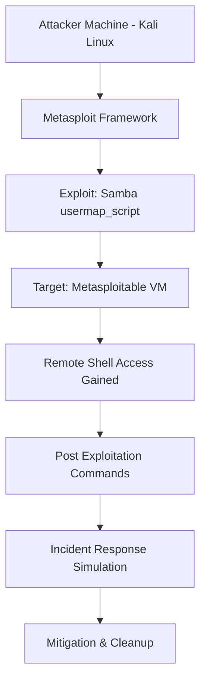

# Capstone Project: Samba Exploitation & Incident Response Simulation

##  Overview
This project demonstrates a controlled security assessment of a vulnerable system using Metasploit Framework. The objective was to identify, exploit, and analyze a known Samba vulnerability in a test environment and simulate a real-world incident response scenario.

Target system used: Metasploitable (intentionally vulnerable VM)

##  Tools Used
- Metasploit Framework
- Nmap
- Netcat payloads
- Metasploitable VM
- Kali Linux

##  Objective
- Perform vulnerability exploitation in a controlled environment
- Gain remote shell access
- Analyze system compromise
- Simulate incident response lifecycle

##  Network Architecture

Attacker Machine (Kali Linux)
        ↓
Metasploit Framework Attack
        ↓
Target Machine (Metasploitable)

##  Exploitation Summary

### 1. Exploit Used
exploit/multi/samba/usermap_script

### 2. Payload
cmd/unix/reverse

### 3. Target
Metasploitable VM

##  Attack Process

1. Identified target IP using network scanning
2. Confirmed Samba service running on ports 139 and 445
3. Launched Metasploit Framework
4. Selected Samba exploit module
5. Configured:
   - RHOSTS = Target IP
   - LHOST = Attacker IP (Kali)
   - Payload = reverse shell
6. Executed exploit successfully
7. Gained remote shell access

## 🖧 Attack Flow Diagram

##  Post Exploitation Activities

Executed system reconnaissance commands:
- whoami
- id
- hostname
- ps aux

Verified successful compromise of target system.

##  Incident Response Simulation

### Detection
- Unauthorized remote shell access detected

### Analysis
- Exploitation via vulnerable Samba service

### Containment
- Terminated malicious shell session
- Identified attacker connection

### Eradication
- Stopped vulnerable service (smbd)
- Recommended patching Samba

##  Mitigation Strategies
- Disable unused services
- Patch Samba vulnerabilities
- Restrict SMB ports via firewall
- Implement intrusion detection systems
- Regular vulnerability scanning

## 📸 Evidence

|       Step           |         Screenshot                |
|----------------------|-----------------------------------|
| Exploit Execution    | 
        |
| Session Opened       | 
 |
| Post Exploitation    | 
     |

##  Key Learning Outcomes
- Understanding SMB vulnerabilities
- Real-world exploitation workflow
- Metasploit usage
- Incident response lifecycle
- System compromise analysis

